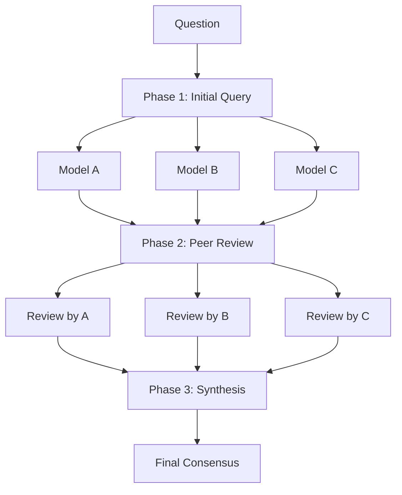

# Copilot Quorum

[](https://www.rust-lang.org/)
[](LICENSE-MIT)

> Multiple LLMs discuss and reach consensus on your questions.
>
> 複数のLLMが議論してあなたの質問に対するコンセンサスを導き出します。

**Rust implementation of [copilot-council](https://github.com/openjny/copilot-council)**

---

## Features / 特徴

- **Multi-Model Council** - 複数AIモデルによる合議制
- **Peer Review** - 匿名化された相互レビュー
- **Synthesis** - モデレーターによる最終統合
- **Parallel Execution** - 非同期並列処理
- **Fault Tolerant** - 一部失敗しても続行可能
- **Pluggable Architecture** - DDD + オニオンアーキテクチャによる拡張性

---

## How It Works / 仕組み

### Model Roles / モデルの役割

| Role | Description |
|------|-------------|
| **Quorum Models** | 議論に参加するモデル。Phase 1で質問に回答し、Phase 2で相互レビューを行う |
| **Moderator** | 議長役。Phase 3で全員の回答とレビューを統合して最終結論を出す |

Agent モードでは、Primary Model（エージェントの主モデル）がタスク実行・プラン作成を担当し、危険な操作やプランのレビュー時に Quorum Models が合議 → Moderator がまとめる、という流れになります。

### Phases / フェーズ

```
+-- Phase 1: Initial Query --+
| 全モデルに並列で質問        |
+----------------------------+
            |
+-- Phase 2: Peer Review ----+
| 匿名で相互レビュー          |
+----------------------------+
            |
+-- Phase 3: Synthesis ------+
| モデレーターが統合          |
+----------------------------+
```



---

## Installation / インストール

### From Source / ソースからビルド

```bash
git clone https://github.com/archie/copilot-quorum
cd copilot-quorum
cargo install --path cli
```

### Requirements / 必要なもの

- [Rust](https://www.rust-lang.org/) 1.85+ (Edition 2024)
- GitHub Copilot CLI (`copilot` command)
- Active Copilot subscription

---

## Usage / 使い方

### Basic / 基本的な使用例

```bash
copilot-quorum "What's the best way to handle errors in Rust?"
```

### With Model Selection / モデルを指定

```bash
copilot-quorum -m claude-sonnet-4.5 -m gpt-5.2-codex "Compare async/await patterns"
```

### Full Output / 全フェーズの出力

```bash
copilot-quorum -o full "Explain the actor model"
```

### Options / オプション一覧

| Option | Short | Description |
|--------|-------|-------------|
| `--model <MODEL>` | `-m` | モデル指定（複数可） |
| `--moderator <MODEL>` | | シンセシス用モデル |
| `--no-review` | | ピアレビューをスキップ |
| `--output <FORMAT>` | `-o` | 出力形式 (`full` / `synthesis` / `json`) |
| `--verbose` | `-v` | 詳細ログを表示 |
| `--quiet` | `-q` | プログレス表示を抑制 |

---

## Available Models / 利用可能なモデル

| Provider | Models |
|----------|--------|
| **Claude** | `claude-sonnet-4.5`, `claude-opus-4.5`, `claude-haiku-4.5`, `claude-sonnet-4` |
| **GPT** | `gpt-5.2-codex`, `gpt-5.1-codex-max`, `gpt-5.1-codex`, `gpt-5.2`, `gpt-5.1`, `gpt-5`, `gpt-5.1-codex-mini`, `gpt-5-mini`, `gpt-4.1` |
| **Gemini** | `gemini-3-pro-preview` |

**Default models / デフォルトモデル:** `gpt-5.2-codex`, `claude-sonnet-4.5`, `gemini-3-pro-preview`

---

## Architecture / アーキテクチャ

DDD + オニオンアーキテクチャを採用し、高い拡張性と保守性を実現しています。

```
copilot-quorum/
├── domain/          # ドメイン層 - ビジネスロジックの核心
├── application/     # アプリケーション層 - ユースケース
├── infrastructure/  # インフラ層 - 外部システム連携
├── presentation/    # プレゼンテーション層 - UI
└── cli/             # エントリポイント (DI構築)
```

### Dependency Flow / 依存の方向

```
           cli/
             |
      presentation/
             |
infrastructure/ --> application/
        |                |
        +----> domain/ <-+
```

詳細は [docs/ARCHITECTURE.md](docs/ARCHITECTURE.md) を参照してください。

---

## Development / 開発

```bash
# Build / ビルド
cargo build

# Run tests / テスト実行
cargo test

# Run with debug logging / デバッグログ付きで実行
RUST_LOG=debug cargo run -p copilot-quorum -- "Your question"

# Generate documentation / ドキュメント生成
cargo doc --open
```

---

## License / ライセンス

MIT OR Apache-2.0

---

## Credits / クレジット

- Original concept: [copilot-council](https://github.com/openjny/copilot-council) by [@openjny](https://github.com/openjny)
- Inspired by Andrej Karpathy's "LLM Council" pattern
