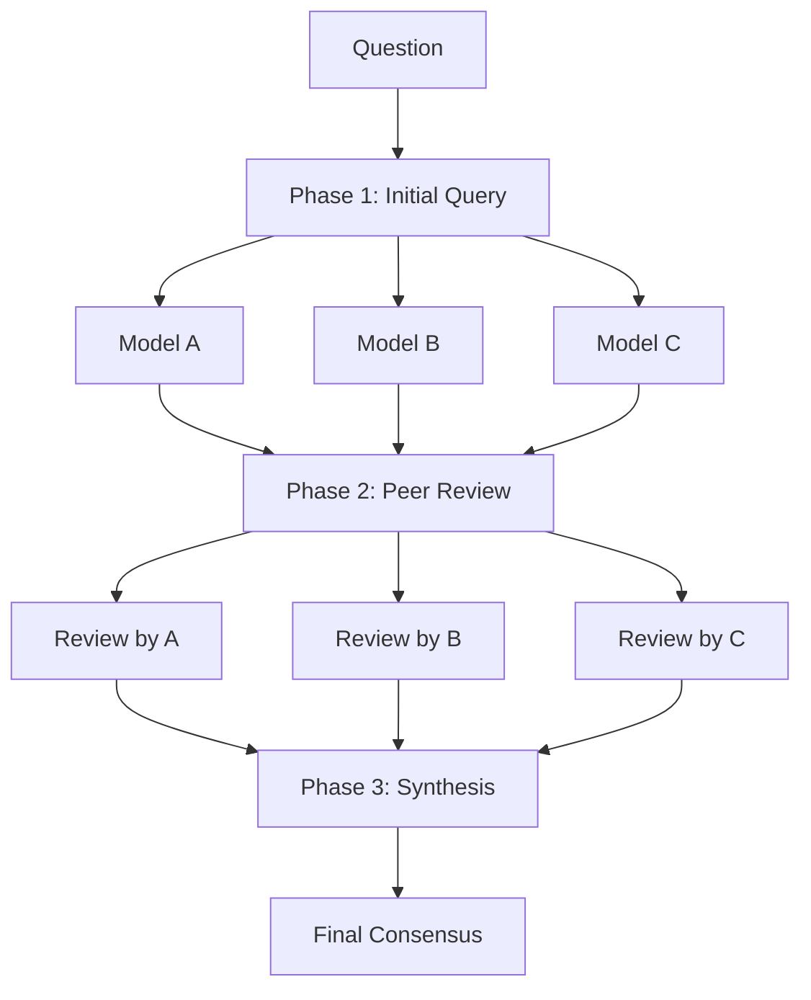
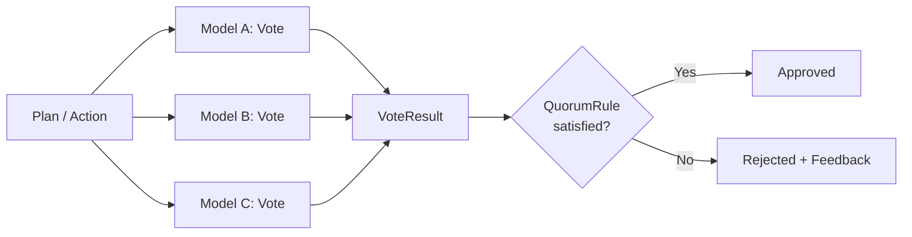

# Quorum Discussion & Consensus / 合議と合意形成

> Multi-model discussion and voting-based consensus for reliable AI decisions
>
> 複数モデルによる議論と投票ベースの合意形成で、信頼性の高い AI 判断を実現

---

## Overview / 概要

**Quorum** は分散システムにおける合意形成の概念を LLM に応用したものです。
単一モデルの判断に依存せず、複数モデルの視点を収集・統合することで、
ハルシネーションや盲点を抑制し、より信頼性の高いアウトプットを得ることを目指しています。

Quorum は 2 つの主要な仕組みで構成されています：

- **Quorum Discussion** - 複数モデルによる対等な議論（意見収集 → 相互レビュー → 統合）
- **Quorum Consensus** - 投票による合意形成（承認/却下の判定）

Quorum Discussion は一般的な質問への回答に、Quorum Consensus はエージェントの計画・アクションレビューに使用されます。

---

## Quick Start / クイックスタート

```bash
# Quorum Discussion（3フェーズの議論）
copilot-quorum "What's the best way to handle errors in Rust?"

# モデルを指定して Discussion
copilot-quorum -m claude-sonnet-4.5 -m gpt-5.2-codex "Compare async/await patterns"

# 全フェーズの出力を表示
copilot-quorum -o full "Explain the actor model"

# REPL で Discussion を実行
copilot-quorum --chat
> /discuss What are the tradeoffs of microservices?
```

---

## How It Works / 仕組み

### Quorum Discussion

Quorum Discussion は 3 つのフェーズで進行します：

```
+-- Phase 1: Initial Query --+
| 全モデルに並列で質問        |
+----------------------------+
            |
+-- Phase 2: Peer Review ----+
| 匿名で相互レビュー          |
+----------------------------+
            |
+-- Phase 3: Synthesis ------+
| モデレーターが統合          |
+----------------------------+
```



#### Phase 1: Initial Query / 初期回答

全モデルに同じ質問を **並列** で送信します。各モデルは独立して回答を生成するため、
多様な視点が集まります。

#### Phase 2: Peer Review / 相互レビュー

各モデルが他のモデルの回答を **匿名化された状態で** レビューします。
匿名化によって「どのモデルが回答したか」というバイアスを排除し、
内容の質に基づいたレビューを促します。

#### Phase 3: Synthesis / 統合

モデレーター（議長役モデル）が、全員の回答とレビュー結果を踏まえて
最終的な統合結論を出します。矛盾する意見がある場合は、その理由を分析し、
バランスの取れた結論を導きます。

### Model Roles / モデルの役割

| Role | Description |
|------|-------------|
| **Quorum Models** | 議論に参加するモデル。Phase 1 で質問に回答し、Phase 2 で相互レビューを行う |
| **Moderator** | 議長役。Phase 3 で全員の回答とレビューを統合して最終結論を出す |

### Quorum Consensus

Quorum Consensus は、エージェントシステムにおける **投票ベースの承認/却下** メカニズムです。
計画レビューやアクションレビューで使用されます。



各モデルが APPROVE または REJECT を投票し、設定された `QuorumRule` に基づいて結果が決定されます。

#### QuorumRule / 合意ルール

| Rule | Description | Example |
|------|-------------|---------|
| `Majority` | 過半数の承認で可決（デフォルト） | 3 モデル中 2 以上で承認 |
| `Unanimous` | 全員一致で可決 | 3 モデル全員が承認 |
| `AtLeast(n)` | 最低 n 票の承認で可決 | `atleast:2` → 2 票以上で承認 |
| `Percentage(p)` | p% 以上の承認で可決 | `75%` → 75% 以上で承認 |

#### Vote / 投票

```rust
pub struct Vote {
    pub model: String,           // モデル識別子
    pub approved: bool,          // 承認/拒否
    pub reasoning: String,       // 理由・フィードバック
    pub confidence: Option<f64>, // 信頼度 (0.0-1.0)
}
```

投票結果は `VoteResult` に集約され、視覚的なサマリー（例: `[●●○]`）で表示されます。
`●` は承認、`○` は却下を表します。

#### ConsensusRound / 合意ラウンド

合意形成の 1 ラウンドを記録するエンティティです。
エージェントのプランレビューで却下された場合、修正 → 再投票のサイクルを複数ラウンド実行できます。

```rust
pub struct ConsensusRound {
    pub round: usize,              // ラウンド番号（1から）
    pub outcome: ConsensusOutcome, // Approved / Rejected / Pending
    pub rule: QuorumRule,          // 使用されたルール
    pub votes: Vec<Vote>,         // 個別投票
    pub result: VoteResult,       // 集約結果
}
```

---

## Configuration / 設定

```toml
# quorum.toml

[quorum]
rule = "majority"        # "majority", "unanimous", "atleast:2", "75%"
min_models = 2           # 有効な合意に必要な最小モデル数

[quorum.discussion]
models = ["claude-sonnet-4.5", "gpt-5.2-codex", "gemini-3-pro-preview"]
moderator = "claude-opus-4.5"
enable_peer_review = true   # Phase 2 を有効化（false でスキップ可能）

[behavior]
enable_review = true   # ピアレビューをデフォルトで有効化

[output]
format = "synthesis"   # "full"（全フェーズ表示）, "synthesis"（統合のみ）, "json"
```

CLI フラグ:

| Flag | Description |
|------|-------------|
| `-m, --model <MODEL>` | 参加モデルを指定（複数可） |
| `--moderator <MODEL>` | モデレーターを指定 |
| `--no-review` | ピアレビュー (Phase 2) をスキップ |
| `-o, --output <FORMAT>` | 出力形式（full / synthesis / json） |

---

## Architecture / アーキテクチャ

### Key Files / 主要ファイル

| File | Description |
|------|-------------|
| `domain/src/quorum/vote.rs` | `Vote`, `VoteResult` 型の定義 |
| `domain/src/quorum/rule.rs` | `QuorumRule` 合意ルール定義 |
| `domain/src/quorum/consensus.rs` | `ConsensusRound`, `ConsensusOutcome` 定義 |
| `domain/src/orchestration/` | `Phase`, `QuorumRun`, `QuorumResult`, `OrchestrationStrategy` |
| `application/src/use_cases/run_quorum.rs` | `RunQuorumUseCase` ユースケース |
| `domain/src/prompt/template.rs` | 各フェーズのプロンプトテンプレート |

### Data Flow / データフロー

```
User Question
    │
    ▼
RunQuorumUseCase
    │
    ├── Phase 1: Initial Query
    │   ├── Model A (parallel) → Response A
    │   ├── Model B (parallel) → Response B
    │   └── Model C (parallel) → Response C
    │
    ├── Phase 2: Peer Review
    │   ├── A reviews [B, C] (anonymized)
    │   ├── B reviews [A, C] (anonymized)
    │   └── C reviews [A, B] (anonymized)
    │
    └── Phase 3: Synthesis
        └── Moderator synthesizes all → Final Consensus
```

非同期処理は `tokio` ランタイム上で `JoinSet` を使って並列化されています。

### OrchestrationStrategy

Quorum Discussion の実行フローはプラグイン可能な戦略パターンで実装されています。
`OrchestrationStrategy` trait を実装することで、新しい議論戦略を追加できます。

```rust
/// Trait for orchestration strategies (domain/src/orchestration/strategy.rs)
#[async_trait]
pub trait OrchestrationStrategy: Send + Sync {
    fn name(&self) -> &'static str;
    fn phases(&self) -> Vec<Phase>;
    async fn execute<G: LlmGateway>(
        &self,
        question: &Question,
        models: &[Model],
        moderator: &Model,
        gateway: &G,
        notifier: &dyn ProgressNotifier,
    ) -> Result<QuorumResult, DomainError>;
}
```

| Strategy | Phases | Description |
|----------|--------|-------------|
| `ThreePhaseStrategy` | Initial → Review → Synthesis | 標準の 3 フェーズ議論（デフォルト） |
| `FastStrategy` | Initial → Synthesis | レビューをスキップした高速モード |
| `DebateStrategy` | モデル間の議論 | インターモデル討論 |

定義ファイル: `domain/src/orchestration/strategy.rs`

---

## Related Features / 関連機能

- [Agent System](../systems/agent-system.md) - Quorum Consensus を計画・アクションレビューで使用
- [Ensemble Mode](./ensemble-mode.md) - 複数モデルの独立計画生成で Quorum の仕組みを活用
- [CLI & Configuration](../guides/cli-and-configuration.md) - `/discuss` コマンドで Discussion を実行

<!-- LLM Context: Quorum は copilot-quorum のコア概念。Discussion は 3 フェーズ（Initial Query → Peer Review → Synthesis）の議論プロセス。Consensus は Vote + QuorumRule による承認/却下メカニズム。主要ファイルは domain/src/quorum/ と application/src/use_cases/run_quorum.rs。 -->
