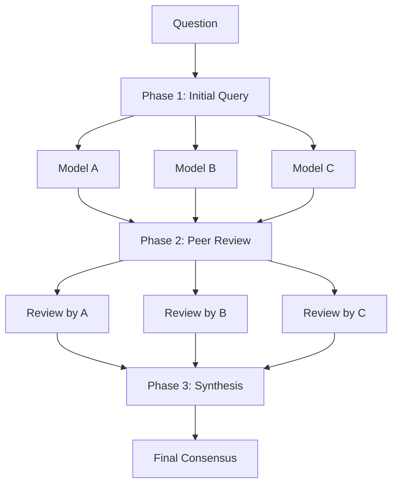
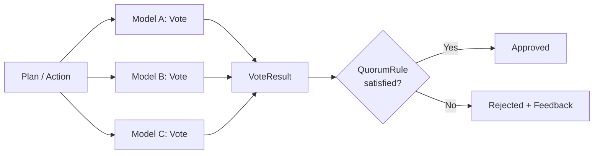

# Quorum Discussion & Consensus / 合議と合意形成

> Multi-model discussion and voting-based consensus for reliable AI decisions
>
> 複数モデルによる議論と投票ベースの合意形成で、信頼性の高い AI 判断を実現

---

## Overview / 概要

**Quorum** は分散システムにおける合意形成の概念を LLM に応用したものです。
単一モデルの判断に依存せず、複数モデルの視点を収集・統合することで、
ハルシネーションや盲点を抑制し、より信頼性の高いアウトプットを得ることを目指しています。

Quorum は 2 つの主要な仕組みで構成されています：

- **Quorum Discussion** - 複数モデルによる対等な議論（意見収集 → 相互レビュー → 統合）
- **Quorum Consensus** - 投票による合意形成（承認/却下の判定）

Quorum Discussion は一般的な質問への回答に、Quorum Consensus はエージェントの計画・アクションレビューに使用されます。

実行方法は [How to Run a Quorum Discussion](../how-to/run-a-quorum-discussion.md) を参照してください。

### Distributed Systems Analogy / 分散システムとの概念マッピング

分散データベースでは、複数ノードの過半数（quorum）が合意して初めて操作が確定します。
copilot-quorum はこの仕組みを LLM に適用しています。

| 分散システム | copilot-quorum | 対応関係 |
|------------|----------------|----------|
| Node (ノード) | Model (LLM) | 処理を担う個々のエンティティ |
| Replication Factor | 参加モデル数 | 参加するノード（モデル）の数 |
| Quorum (定足数) | Quorum Consensus | 過半数の合意で操作を確定 |
| Read/Write 操作 | Plan/Action Review | データ操作 → タスク操作 |
| Consistency Level | `ConsensusLevel` | 何ノード（モデル）の応答を要求するか |

分散データベース Cassandra の `ConsistencyLevel` との具体的な対応：

| Cassandra | copilot-quorum | 意味 |
|-----------|----------------|------|
| `ConsistencyLevel.ONE` | `ConsensusLevel::Solo` | 1 ノード（モデル）の応答で十分 |
| `ConsistencyLevel.QUORUM` | `ConsensusLevel::Ensemble` | 過半数のノード（モデル）が合意必要 |

Cassandra が `ConsistencyLevel` を変えるだけで一貫性と可用性のトレードオフを制御できるように、
copilot-quorum も `ConsensusLevel` を `Solo` ↔ `Ensemble` に切り替えるだけで
速度と信頼性のトレードオフを制御できます。

Quorum の概念を LLM の文脈で具体化すると、3 つの機能になります：

- **Quorum Discussion**: 複数モデルによる対等な議論（意見収集）— Read Quorum に相当
- **Quorum Consensus**: 投票による合意形成（承認/却下の判定）— Write Quorum に相当
- **Quorum Synthesis**: 複数意見の統合・矛盾解決 — Conflict Resolution に相当

---

## How It Works / 仕組み

### Quorum Discussion

Quorum Discussion は 3 つのフェーズで進行します：

```
+-- Phase 1: Initial Query --+
| 全モデルに並列で質問        |
+----------------------------+
            |
+-- Phase 2: Peer Review ----+
| 匿名で相互レビュー          |
+----------------------------+
            |
+-- Phase 3: Synthesis ------+
| モデレーターが統合          |
+----------------------------+
```



#### Phase 1: Initial Query / 初期回答

全モデルに同じ質問を **並列** で送信します。各モデルは独立して回答を生成するため、
多様な視点が集まります。

#### Phase 2: Peer Review / 相互レビュー

各モデルが他のモデルの回答を **匿名化された状態で** レビューします。
匿名化によって「どのモデルが回答したか」というバイアスを排除し、
内容の質に基づいたレビューを促します。

#### Phase 3: Synthesis / 統合

モデレーター（議長役モデル）が、全員の回答とレビュー結果を踏まえて
最終的な統合結論を出します。矛盾する意見がある場合は、その理由を分析し、
バランスの取れた結論を導きます。

### Model Roles / モデルの役割

| Role | Description |
|------|-------------|
| **Quorum Models** | 議論に参加するモデル。Phase 1 で質問に回答し、Phase 2 で相互レビューを行う |
| **Moderator** | 議長役。Phase 3 で全員の回答とレビューを統合して最終結論を出す |

### Quorum Consensus

Quorum Consensus は、エージェントシステムにおける **投票ベースの承認/却下** メカニズムです。
計画レビューやアクションレビューで使用されます。



各モデルが APPROVE または REJECT を投票し、設定された `QuorumRule` に基づいて結果が決定されます。

#### QuorumRule / 合意ルール

| Rule | Description | Example |
|------|-------------|---------|
| `Majority` | 過半数の承認で可決（デフォルト） | 3 モデル中 2 以上で承認 |
| `Unanimous` | 全員一致で可決 | 3 モデル全員が承認 |
| `AtLeast(n)` | 最低 n 票の承認で可決 | `atleast:2` → 2 票以上で承認 |
| `Percentage(p)` | p% 以上の承認で可決 | `75%` → 75% 以上で承認 |

投票が却下された場合はフィードバック付きで差し戻され、修正 → 再投票のサイクルを
複数ラウンド実行できます。`Vote` / `VoteResult` / `ConsensusRound` などの型定義は
[Orchestration Internals](../reference/orchestration-internals.md) を参照してください。

---

## Related / 関連

- [How to Run a Quorum Discussion](../how-to/run-a-quorum-discussion.md) - 実行手順と設定方法
- [Orchestration Internals](../reference/orchestration-internals.md) - 主要ファイル・データフロー・型定義
- [Agent Behavior](./agent-behavior.md) - Quorum Consensus を使う計画・アクションレビュー
- [Ensemble Mode](./ensemble-mode.md) - 複数モデルの独立計画生成で Quorum の仕組みを活用
- [ADR 0003: Restore Quorum Consensus Level](./design-decisions/0003-restore-quorum-consensus-level.md) - Solo/Ensemble 導入の経緯

<!-- LLM Context: Quorum は copilot-quorum のコア概念。Discussion は 3 フェーズ（Initial Query → Peer Review → Synthesis）の議論プロセス。Consensus は Vote + QuorumRule による承認/却下メカニズム。StrategyExecutor trait（旧 OrchestrationStrategy trait）で議論戦略をプラグイン可能。OrchestrationStrategy は enum（Quorum/Debate の variant）。主要ファイルは domain/src/quorum/（vote.rs, rule.rs, consensus.rs）、domain/src/orchestration/strategy.rs（StrategyExecutor trait, OrchestrationStrategy enum）、application/src/use_cases/run_quorum.rs（RunQuorumUseCase）。 -->
